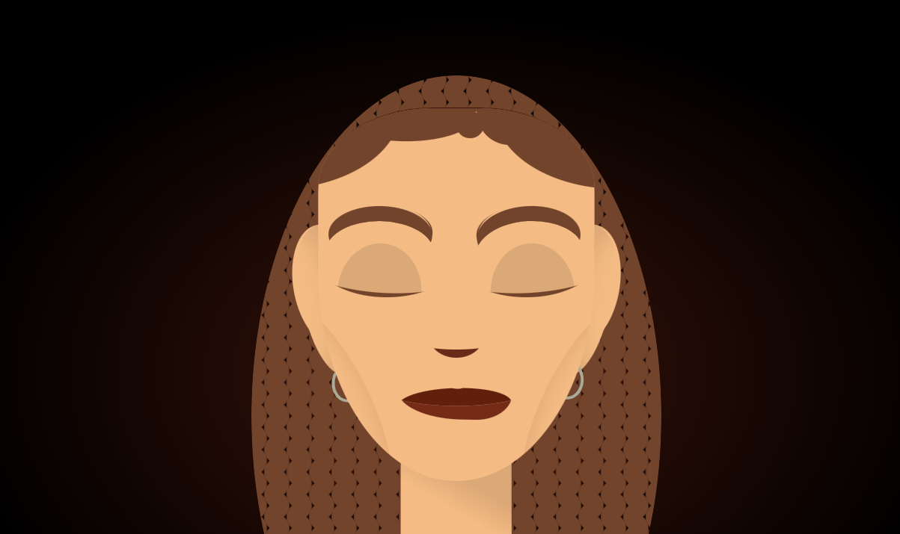

# Cartoon Self-Portrait

This is a cartoon self-portrait drawing of myself. 

## Preview

## Tools Used
- HTML
- CSS

## Features
- Customizable facial features
- Responsive design
- Detailed styling using CSS

## How to Use
1. Clone the repository.
2. Open `index.html` in your browser to view the portrait.
3. Modify the `style.css` file to customize the portrait.

## File Structure
- `index.html`: The main HTML file.
- `style.css`: The CSS file containing styles for the portrait.

## Aknowledgements
- [Codepen](https://codepen.io/alvaromontoro/pen/mdPpELL) for the inspiration.
- [CSS-Generator](https://css-generators.com/) for the hair.

